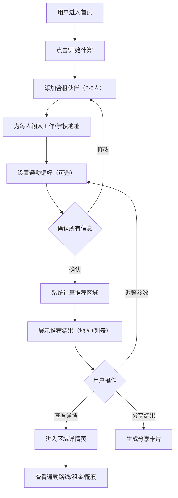

## 1. 产品概述

「合租通」是一个为深圳多地点上班/上学人群提供最优合租地点推荐的 Web 应用。用户输入多个室友的工作或学校地址，系统基于深圳地铁通勤数据、租金水平和生活配套，智能计算出对所有人最公平、最方便的合租区域，并可视化展示通勤路线和区域分析。

- **核心问题**：多人合租时，各自通勤距离差异大，难以快速找到让所有人都能接受的折中居住区域
- **目标用户**：在深圳不同区域工作/上学的年轻白领和大学生（2-6人合租群体）
- **产品价值**：将传统"凭感觉讨论"的选房过程变为数据驱动的精准推荐，节省找房时间 60% 以上

## 2. 核心功能

### 2.1 功能模块

1. **首页**：场景入口页，展示产品价值主张和快速开始按钮
2. **合租伙伴配置页**：添加/编辑多个室友的工作或学校地址，设置每个人的通勤偏好
3. **推荐结果页**：地图可视化 + 列表形式展示推荐区域，包含通勤分析
4. **区域详情页**：单个推荐区域的深度分析（租金、配套、通勤路线）

### 2.2 页面详情

| 页面名称 | 模块名称 | 功能描述 |
|----------|----------|----------|
| 首页 | Hero 区域 | 产品名称、一句话价值主张、CTA 按钮"开始计算" |
| 首页 | 使用说明 | 三步使用流程图示，让新用户快速理解 |
| 合租伙伴配置 | 人员添加面板 | 添加/删除成员，每人输入上班/上学地点（自动补全深圳地铁站或地标） |
| 合租伙伴配置 | 偏好设置 | 设置每个人可接受的最大通勤时间、交通方式偏好（地铁/公交/综合） |
| 合租伙伴配置 | 可视化预览 | 地图上实时显示所有人员的通勤起点标记 |
| 推荐结果页 | 地图视图 | 在地图上展示：所有人员起点（彩色标记）、推荐合租区域（热力图半径）、地铁线路高亮 |
| 推荐结果页 | 推荐列表 | 排名 Top 5 推荐区域，每项展示：区域名称、综合评分、人均通勤时间、预估租金范围 |
| 推荐结果页 | 通勤对比 | 表格展示每个推荐区域内每个人的预计通勤时间和路线 |
| 推荐结果页 | 筛选排序 | 按租金、通勤时间、评分等维度筛选和排序 |
| 区域详情页 | 通勤路线详情 | 展示从该区域到每个人工作/上学地点的具体地铁路线（换乘站、耗时） |
| 区域详情页 | 租金分析 | 该区域合租单间均价、与深圳均价的对比 |
| 区域详情页 | 生活配套 | 周边地铁站数量、商圈、餐饮评分、公园等 |
| 区域详情页 | 分享功能 | 生成分享卡片，可将推荐结果分享给合租伙伴 |

## 3. 核心流程

## 4. 推荐算法设计

### 4.1 核心算法：加权通勤公平性评分

目标：找到一个居住区域，使得所有室友的通勤体验最接近"公平"。

**步骤 1：候选区域生成**
- 将所有成员的工作/学校地点标注在深圳地图上
- 基于所有点围成的多边形，在内部及扩展 2km 范围内生成候选网格（500m × 500m）
- 筛选有地铁站覆盖的网格作为候选区域（地铁站 1km 范围内）

**步骤 2：通勤时间计算**
- 使用深圳地铁线路数据（14 条线 + 在建线路）
- 对每个候选区域，计算到每个成员目的地的地铁路线（最短路径算法 BFS/Dijkstra）
- 考虑换乘次数（每次换乘 +3 分钟额外惩罚）
- 输出：每个候选区域 → 每个成员的通勤时间矩阵

**步骤 3：多维度评分**

| 评分维度 | 权重 | 计算方式 |
|----------|------|----------|
| 通勤公平性 | 40% | 1 - (最长通勤 - 最短通勤) / 最长通勤，差异越小分越高 |
| 平均通勤时间 | 25% | 所有人通勤时间的平均值越低越好 |
| 租金可负担性 | 20% | 区域合租单间均价与深圳平均的对比，越低越好 |
| 生活配套 | 10% | 周边地铁线路数、商圈、餐饮密度 |
| 通勤体验 | 5% | 直达率（无需换乘的比例）、换乘次数 |

**步骤 4：排序输出**
- 综合加权得分排序，输出 Top 5 推荐区域
- 附加标注"最佳公平性"、"最短总通勤"、"最低租金"等标签

### 4.2 数据来源

| 数据 | 来源 | 说明 |
|------|------|------|
| 深圳地铁线路与站点 | 内置静态数据（2026年更新） | 14条运营线路 + 规划线路 |
| 区域租金参考 | 内置静态数据（季度更新） | 基于公开租房平台数据汇总 |
| 地标/公司地址 | 内置常用地标库 + 用户自由输入 | 科技园、车公庙、华强北等 |
| 生活配套评分 | 内置静态数据 | 基于POI密度计算 |

## 5. 用户界面设计

### 5.1 设计风格

- **主色调**：深海蓝（#0A1929）+ 活力青（#00F0FF），传达科技感与信任感
- **辅助色**：暖橙色（#FF6B35）用于 CTA 和重点标注
- **背景**：深色主题，带微妙的深圳天际线暗纹
- **字体**：标题用 "DM Serif Display"，正文用 "DM Sans"
- **布局**：地图占据核心视觉区域，信息卡片侧边栏浮动叠加
- **风格方向**：城市科技感 + 地图驱动 + 数据可视化美学

### 5.2 页面设计概览

| 页面名称 | 模块名称 | UI 元素 |
|----------|----------|---------|
| 首页 | Hero 区域 | 全屏深色背景 + 深圳地铁线路动画，居中标题 + CTA 按钮（暖橙色，3D悬浮效果） |
| 首页 | 使用步骤 | 三列横向卡片，图标 + 简短文字，悬停时向上浮动 |
| 配置页 | 人员面板 | 卡片式表单，每人一个卡片（可拖拽排序），头像占位 + 地址输入框 + 自动补全下拉 |
| 配置页 | 地图预览 | 半透明地图叠加层，实时显示已添加成员的标记点 |
| 结果页 | 地图视图 | 全屏 Leaflet 地图，自定义地铁线路颜色，推荐区域用脉冲圆形标记，起点用彩色大头针 |
| 结果页 | 推荐面板 | 右侧悬浮面板，卡片列表展示 Top 5 区域，每张卡片含：排名徽章、评分环形图、通勤统计 |
| 结果页 | 通勤对比表 | 可展开的对比表格，热力图单元格（绿→黄→红表示通勤时间长短） |
| 详情页 | 通勤路线 | 交互式地铁路线图，高亮推荐路线，标注换乘站和预估时间 |
| 详情页 | 租金图表 | 横向柱状图，对比该区域与周边区域的租金 |
| 详情页 | 配套雷达图 | 五维雷达图：交通/餐饮/购物/医疗/休闲 |

### 5.3 响应式设计

- 桌面端（>1024px）：地图 + 侧边栏双栏布局
- 平板端（768-1024px）：地图缩小，侧边栏变窄
- 手机端（<768px）：地图和列表垂直堆叠，底部 Tab 切换视图
- 触摸优化：地图支持双指缩放，输入框弹出时自动滚动

## 6. 非功能需求

- 首次计算响应时间 < 3 秒
- 地图加载时间 < 2 秒
- 支持同时输入 2-6 个成员的地址
- 推荐结果覆盖深圳核心区域（南山、福田、罗湖、宝安、龙华、龙岗）
- 浏览器兼容：Chrome 90+、Edge 90+、Safari 15+
