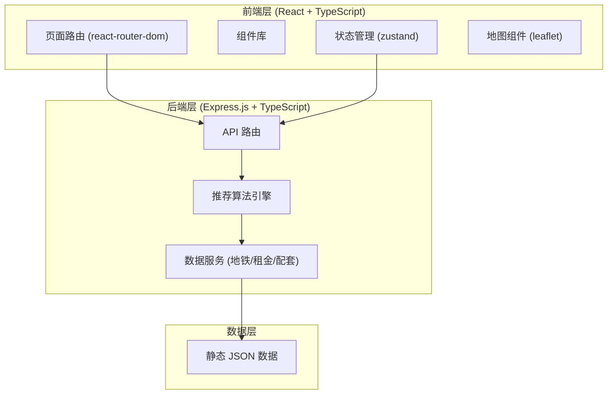
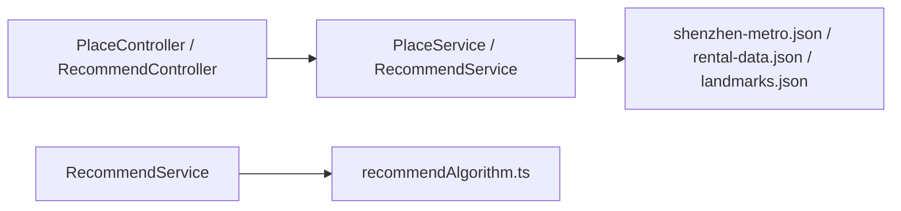
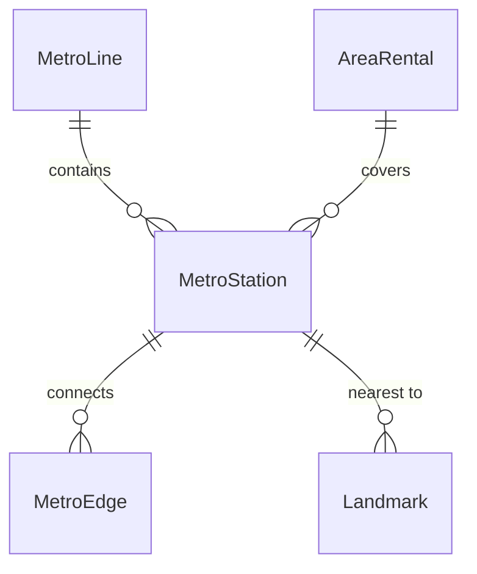

## 1. 架构设计



## 2. 技术选型

- **前端**：React@18 + TypeScript + Tailwind CSS@3 + Vite
- **初始化工具**：vite-init (react-express-ts 模板)
- **状态管理**：zustand
- **路由**：react-router-dom v6
- **地图**：leaflet + react-leaflet
- **图表可视化**：recharts
- **后端**：Express@4 + TypeScript
- **UI 图标**：lucide-react
- **HTTP 客户端**：fetch API（原生）
- **数据存储**：静态 JSON 文件（深圳地铁数据、区域租金数据、地标数据）

## 3. 路由定义

| 路由 | 页面 | 说明 |
|------|------|------|
| / | 首页 | 产品介绍和入口 |
| /configure | 合租伙伴配置页 | 添加成员、设置地址和偏好 |
| /results | 推荐结果页 | 地图 + 推荐列表 |
| /results/:areaId | 区域详情页 | 单个区域的深度分析 |

## 4. API 定义

### 4.1 地址自动补全

```
GET /api/places/search?q=科技园
```

响应：
```typescript
interface PlaceSearchResponse {
  places: Array<{
    id: string
    name: string
    type: 'metro_station' | 'landmark' | 'business_district'
    coordinates: { lat: number; lng: number }
    metroLines: string[]
  }>
}
```

### 4.2 计算推荐区域

```
POST /api/recommend
```

请求体：
```typescript
interface RecommendRequest {
  members: Array<{
    id: string
    name: string
    location: { lat: number; lng: number }
    maxCommuteMinutes: number
    preferMetro: boolean
  }>
}
```

响应：
```typescript
interface RecommendResponse {
  recommendations: Array<{
    areaId: string
    areaName: string
    district: string
    center: { lat: number; lng: number }
    overallScore: number
    scores: {
      commuteFairness: number
      avgCommute: number
      affordability: number
      amenities: number
      commuteExperience: number
    }
    avgCommuteMinutes: number
    maxCommuteMinutes: number
    rentRange: { min: number; max: number }
    label: string
    tags: string[]
  }>
  membersSummary: Array<{
    id: string
    name: string
    color: string
    location: { lat: number; lng: number }
  }>
}
```

### 4.3 区域详情

```
GET /api/areas/:areaId?memberIds=1,2,3
```

响应：
```typescript
interface AreaDetailResponse {
  areaId: string
  areaName: string
  district: string
  center: { lat: number; lng: number }
  rentAnalysis: {
    avgSingleRoom: number
    cityAvg: number
    trend: 'up' | 'stable' | 'down'
  }
  amenities: {
    metroStations: number
    metroLines: string[]
    shoppingMalls: number
    restaurants: number
    parks: number
    hospitals: number
  }
  commuteRoutes: Array<{
    memberId: string
    memberName: string
    minutes: number
    transfers: number
    route: Array<{
      station: string
      line: string
      action: 'board' | 'transfer' | 'alight'
    }>
  }>
}
```

## 5. 服务端架构



## 6. 数据模型

### 6.1 深圳地铁数据

```typescript
interface MetroLine {
  id: string
  name: string // e.g. "1号线（罗宝线）"
  color: string
  stations: MetroStation[]
}

interface MetroStation {
  id: string
  name: string
  coordinates: { lat: number; lng: number }
  transfers: string[] // 可换乘线路ID
}

interface MetroEdge {
  from: string // station id
  to: string
  lineId: string
  minutes: number // 站间行驶时间
}
```

### 6.2 区域租金数据

```typescript
interface AreaRental {
  areaId: string
  areaName: string
  district: string // 南山/福田/罗湖/宝安/龙华/龙岗
  avgSingleRoom: number
  avgMasterRoom: number
  avgSharedRoom: number
  rentScore: number // 0-100，越高越便宜
}
```

### 6.3 地标数据

```typescript
interface Landmark {
  id: string
  name: string
  type: 'tech_park' | 'university' | 'business_center' | 'metro_station'
  coordinates: { lat: number; lng: number }
  nearestStation: string
}
```

### 6.4 ER 关系图



## 7. 静态数据文件

```
api/
├── data/
│   ├── shenzhen-metro.json    # 深圳地铁完整线路和站点数据
│   ├── rental-data.json       # 各区域租金参考数据
│   └── landmarks.json         # 常用地标（科技园、大学城等）
├── routes/
│   ├── places.ts
│   ├── recommend.ts
│   └── areas.ts
├── services/
│   ├── recommendAlgorithm.ts  # 核心推荐算法
│   ├── metroService.ts        # 地铁数据查询
│   └── rentalService.ts       # 租金数据查询
└── index.ts                   # Express 入口
```
